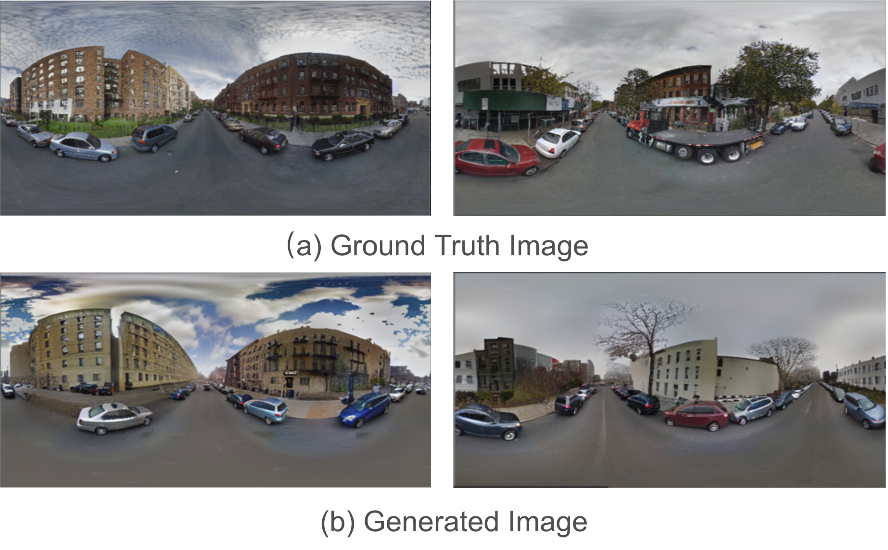
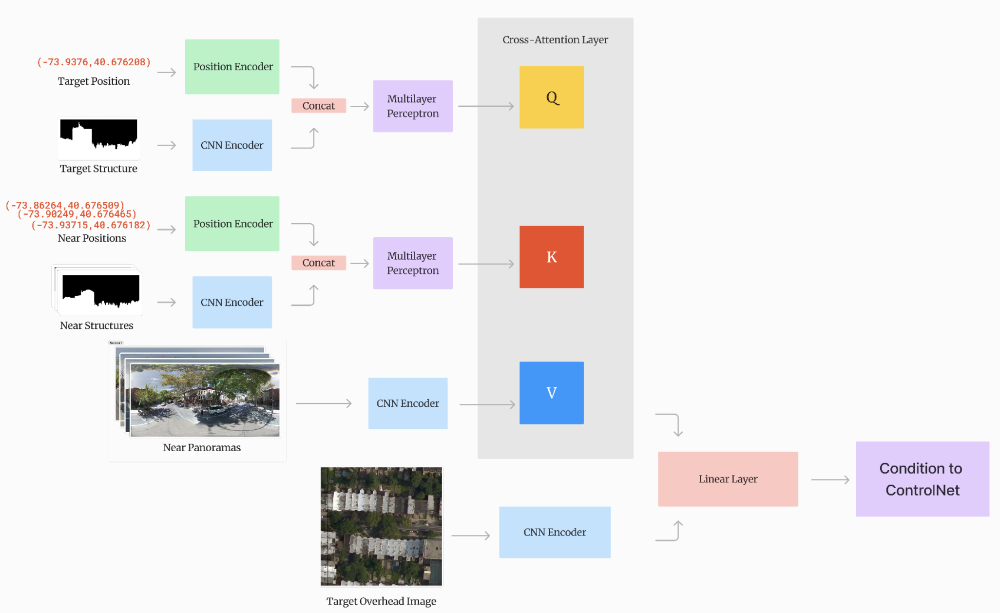

# MixedViewDiff: A Mixed View-based Diffusion Model for Panorama Synthesis

## Overview

MixedViewDiff is a novel panorama synthesis approach combining structural depth estimation from satellite images with style and texture information from nearby panoramas. This model addresses challenges of spatial and texture inconsistencies prevalent in panorama synthesis by integrating satellite-based structural information with street-level imagery.

## 

## Project Description

This project introduces an advanced model leveraging diffusion-based image synthesis (ControlNet and Stable Diffusion) combined with geo-spatial attention mechanisms to accurately synthesize panoramas. The model effectively integrates satellite imagery and nearby panorama views to achieve structurally consistent and stylistically accurate panoramic images.

## Features

- **Cross-view Diffusion**: Incorporates overhead satellite imagery to inform panorama synthesis.
- **Mixed-view Diffusion**: Utilizes structural depth from satellite images and texture from nearby street-level panoramas.
- **Geo-Spatial Attention Encoder**: Implements positional and structural encoding to enhance synthesis accuracy.
- **Data Processing Pipeline**: Efficiently merges and preprocesses satellite imagery and height maps for optimal input quality.
  

## Results

- **Qualitative**: Demonstrated significant improvement in capturing architectural details and textures compared to existing methods.
- **Quantitative**: Achieved competitive SSIM and PSNR scores, validating its effectiveness relative to current state-of-the-art models.

## Implementation

- **Model Architecture**: Utilized ControlNet integrated with pre-trained ResNet-18 for feature extraction.
- **Training Environment**: Executed using two A100 GPUs over multiple days for model convergence.

## Dataset

The dataset comprises processed street-level and satellite imagery from Brooklyn and Queens, optimized to ensure high-quality input for model training and evaluation.

## Contributions

- **Albert Peng**: ControlNet pipeline setup, embedding design.
- **David Wang**: Model implementation, dataset processing.
- **Dijsktra Liu**: Data processing pipeline, data analysis, Model implementation.
- **Sunny Yuan**: Structure map creation, position encoding optimization.

## Reference

For detailed methodological explanations and experimental results, please refer to the full project report provided in this repository.

---

Developed by Albert Peng, David Wang, Dijsktra Liu, and Sunny Yuan at Washington University in St. Louis.
